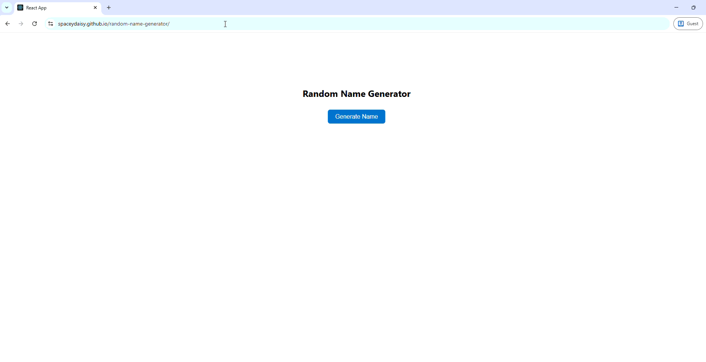

# 🎲 Random Name Generator

A simple React app that generates fun, unique names at the click of a button.  
Built as part of my portfolio to practice **React**, **deployment with GitHub Pages**, and **workflow rituals** for clean builds.

---

## 🚀 Live Demo

👉 [View the app here](https://spaceydaisy.github.io/random-name-generator/)

---

## 📸 Preview

<!-- Replace with your own screenshot or GIF -->

---

## ✨ Features

- Generate random names instantly
- Copy generated names to clipboard with one click
- Responsive design for desktop and mobile
- Deployed on GitHub Pages

---

## 🛠️ Tech Stack

- **React** (Create React App → migrating to Vite/React 19 in progress)
- **JavaScript (ES6+)**
- **CSS3** for styling
- **gh-pages** for deployment

---

## 📂 Project Structure
